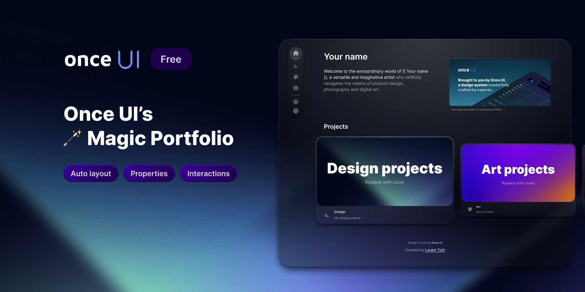

<h1 align="center">Projeto do meu portfólio</h1>

    Escolher o modelo de um portfólio foi demorado, mas finalmente encontrei um que me agradou bastante.

  <a href="#-tecnologias">Tecnologias</a>&nbsp;&nbsp;&nbsp;|&nbsp;&nbsp;&nbsp;
  <a href="#-projeto">Projeto</a>&nbsp;&nbsp;&nbsp;|&nbsp;&nbsp;&nbsp;
  <a href="#-layout">Layout</a>&nbsp;&nbsp;&nbsp;|&nbsp;&nbsp;&nbsp;
  <a href="#memo-licença">Licença</a>

  

 

  Encontre o link para visualisar o protótipo do projeto na sessão layout

  

 

## 🚀 Tecnologias

Este projeto é desenvolvido com as seguintes tecnologias:

- HTML
- CSS
- SASS / SCSS
- JavaScript
- TypeScript
- React.js
- Next.js
- Git e Github
- Figma

## 💻 Projeto

Este projeto é meu portfólio, pensado na melhor experiência para recrutadores e para clientes que buscam dev freelancer, sendo desenvolvido com as tecnologias mais atualizadas do mercado.

## 🔖 Layout

Você pode visualizar o layout base do projeto através [DESSE LINK](https://www.figma.com/file/TlPzUaegk6mcs9F4CnqyR9/Magic-Portfolio-by-Once-UI-(Community)-(Copy)?type=design&node-id=0-1&mode=design&t=2Hx7zTdYlJmsatC9-0). É necessário ter uma conta no [Figma](https://figma.com) para acessá-lo.

## :memo: Licença

Este projeto está licenciado sob a licença do MIT.

---
